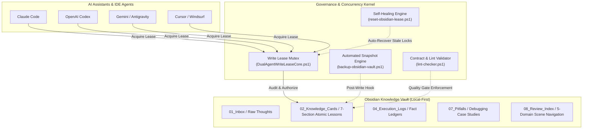

# Agent-Memory-OS 🧠⚡

<p align="center">
  <b>A Local-First, Concurrency-Safe External Memory Operating System for Multi-Agent AI Coding</b><br>
  <i>Stop AI amnesia and race conditions across Claude Code, Codex, Gemini, Cursor, and Windsurf.</i>
</p>

<p align="center">
  <b>English</b> | <a href="README_CN.md">简体中文</a>
</p>

<p align="center">
  
  
  
  
  
</p>

<p align="center">
  
</p>

---

## 🌟 Why Agent-Memory-OS?

Every developer building software with modern AI coding assistants (Claude Code, OpenAI Codex, Gemini, Cursor, Windsurf) faces three fundamental bottlenecks:

1. **The AI Amnesia Trap**: Every new terminal session or window reset wipes the agent's memory clean. The AI repeatedly walks into the exact same pitfalls and burns tokens relearning project lessons.
2. **Multi-Agent Collision & Race Conditions**: When running multiple autonomous assistants concurrently, agents blindly overwrite each other's files, causing severe merge disasters and corrupted worktrees.
3. **Over-Engineered, Fragile Memory Stacks**: Most existing "agent memory" frameworks demand heavy Docker containers, vector databases (Chroma, Milvus), Redis servers, or costly cloud APIs that normal developers cannot easily inspect, edit, or maintain.

**Agent-Memory-OS solves this with an industrial-grade, local-first memory kernel:**

- 📂 **Local-First & Human-Curated**: Built on standard Obsidian Markdown with bidirectional wiki-links. 100% of your engineering knowledge stays on your disk. You can view, search, and edit memories directly in Obsidian.
- 🔒 **Distributed Write Lease Mutex**: A lightweight Chubby/etcd-inspired consensus lease protocol (`DualAgentWriteLeaseCore.ps1`) enforcing strict mutex write boundaries, preventing race conditions, and featuring self-healing auto-recovery.
- 🛡️ **Zero-Manual Snapshot Defense**: Fully automated background rolling backups with SHA256 integrity manifests—never lose a knowledge card to accidental deletion.
- 🎯 **Domain-Targeted Navigation**: A 5-domain scene index preventing token inflation and context dilution when knowledge scales past hundreds of cards.
- 📐 **Rigorous 2-Phase Quality Gates**: Atomic 7-section card contracts + deterministic lint validators preventing hallucinated prompt garbage from poisoning long-term memory.

---

## 🏗️ Core Workflow & Architecture

<p align="center">
  
</p>



---

## ⚡ Comparison Matrix

| Capability Dimension | Single-Session AI Prompts | Heavy RAG / Vector DBs (Chroma/Mem0) | Static Prompt Lists (.cursorrules) | **Agent-Memory-OS (This Project)** |
| :--- | :--- | :--- | :--- | :--- |
| **Persistence** | ❌ Wiped on new session | ⚠️ Complex DB storage | ⚠️ Static, cannot self-evolve | ✅ **Permanent, human-editable Markdown** |
| **Multi-Agent Safety** | ❌ Complete race conditions | ❌ Retrieval only, no write lock | ❌ No concurrency protection | 🏆 **Distributed Write Lease + Self-Healing** |
| **Setup Overhead** | ✅ Zero | ❌ Requires Docker, Redis, APIs | ✅ Copy & Paste | 🏆 **Zero dependencies, unzip & run** |
| **Knowledge Quality** | ❌ Hallucination prone | ⚠️ Vector similarity guesses | ❌ Unchecked text blobs | 🏆 **Strict 7-section cards + Lint tests** |
| **Disaster Recovery** | ❌ Irreversible data loss | ⚠️ Requires database backups | ❌ No backup mechanism | 🏆 **Dual-layer rolling snapshot archives** |
| **Token Efficiency** | ❌ Dumps entire prompts | ⚠️ Vector search noise | ❌ High context dilution | 🏆 **5-domain targeted scene routing** |

---

## 🚀 Quick Start (3 Minutes)

### Step 1: Use This Template
Click the green **[Use this template]** button at the top right of this GitHub page -> **[Create a new repository]**. Clone your new repository locally and open it with [Obsidian](https://obsidian.md/).

### Step 2: Connect Your AI Coding Tools
Mount this vault directory into your development workspace:
- **Claude Code**: Reference `CLAUDE.md` in your project instructions or create a symlink.
- **Gemini / Antigravity**: Reference `GEMINI.md` in your system instructions.
- **Codex / Cursor / Windsurf**: Add to your workspace root prompt:
  > *"Always read `AGENTS.md` and check `08_复盘与沉淀/自动复用索引.md` for domain-relevant lessons before writing code or modifying project architecture."*

### Step 3: Enjoy Continuous Long-Term Memory
Instruct your AI naturally:
- *"Check our knowledge base on how we handle Windows UTF-8 encoding in PowerShell."*  
  → AI queries `02_知识卡片/PowerShell中文UTF8读写.md` and applies the verified pattern.
- *"Extract the root cause of this bug and store it as a permanent lesson."*  
  → AI acquires a Write Lease, formats a standardized 7-section card, verifies it with the Lint validator, and triggers an automated rolling snapshot!

---

## 📂 Repository Layout

```text
Agent-Memory-OS/
├── README.md                     # [This file] English documentation
├── README_CN.md                  # 简体中文完整项目文档
├── AGENTS.md                     # Universal multi-agent rule source
├── CLAUDE.md / GEMINI.md / ...   # Per-agent specialized instructions
├── 一键备份知识库.cmd             # One-click Windows snapshot backup launcher
├── 一键重置写租约.cmd             # One-click lease deadlock recovery launcher
├── 01_收件箱/ (01_Inbox)         # Staging area for raw ideas and unprocessed notes
├── 02_知识卡片/ (02_Cards)       # Atomic verified knowledge cards (7-section contract)
│   └── _drafts/                  # Staged candidate drafts under review
├── 03_项目索引/ (03_Index)       # Cross-project relationship catalog
├── 04_执行记录/ (04_Logs)        # Audit ledger of agent execution runs
├── 05_代码与配置/ (05_Core)      # Concurrency kernel: lease, backup, self-healing, lint
├── 06_测试与验证/ (06_Tests)     # 36+ regression tests & JSON Schema contracts
├── 07_问题与踩坑/ (07_Pitfalls)  # Real-world debugging case studies & root-cause proofs
├── 08_复盘与沉淀/ (08_Memory)    # 5-domain scene routing index & lifecycle reports
└── 09_模板/ (09_Templates)       # Standardized markdown templates
```

---

## 🛡️ Built-In Verification & Tests

Agent-Memory-OS treats AI memory as enterprise software with deterministic test suites:

```powershell
# 1. Validate all knowledge cards syntax, structure, and bidirectional wiki-links
powershell -NoProfile -ExecutionPolicy Bypass -File "05_代码与配置/知识库lint检查器.ps1"

# 2. Run the 36-assertion Distributed Write Lease regression suite
powershell -NoProfile -ExecutionPolicy Bypass -File "06_测试与验证/DualAgentWriteLeaseCore.Tests.ps1"

# 3. Run the 38-assertion Lint validator test suite
powershell -NoProfile -ExecutionPolicy Bypass -File "06_测试与验证/知识库lint检查器.Tests.ps1"
```

---

## 🤝 Contributing & License

This project is open-sourced under the permissive [MIT License](LICENSE).  
Issues and Pull Requests are warmly welcome as we shape the next-generation memory operating system for autonomous AI programming!