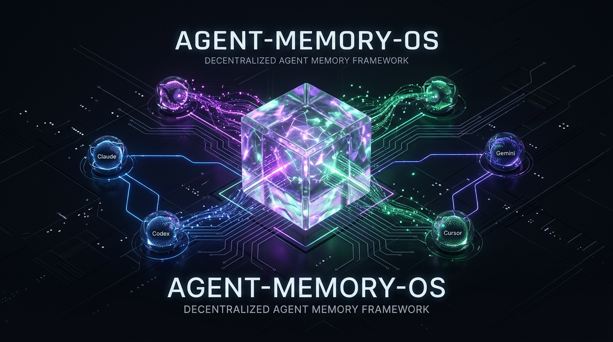
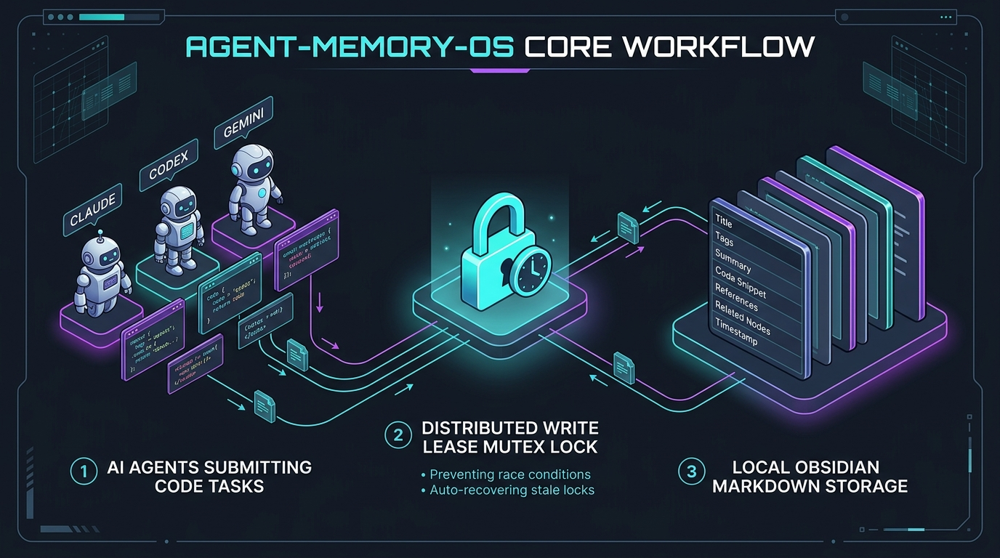
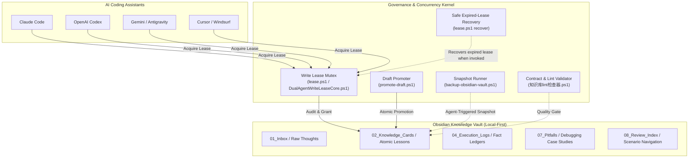

# Agent-Memory-OS 🧠⚡

<p align="center">
  <b>A Local-First, Concurrency-Safe External Memory Starter for Multi-Agent AI Coding</b><br>
  <i>Reduce AI session amnesia and prevent file race conditions across Claude Code, Codex, Gemini, Cursor, and Windsurf.</i>
</p>

<p align="center">
  <b>English</b> | <a href="README_CN.md">简体中文</a>
</p>

<p align="center">
  
  
  
  
  
  
  <a href="https://github.com/a2578348864a-sys/Agent-Memory-OS/actions/workflows/windows-ci.yml"></a>
</p>

<p align="center">
  
</p>

---

## 🌟 Why Agent-Memory-OS?

Every developer building software with modern AI coding assistants (Claude Code, OpenAI Codex, Gemini, Cursor, Windsurf) faces three fundamental bottlenecks:

1. **The AI Amnesia Trap**: Every new terminal session or window reset wipes the agent's memory clean. The AI repeatedly walks into the exact same pitfalls and burns tokens relearning project lessons.
2. **Multi-Agent Collision & Race Conditions**: When running multiple autonomous assistants concurrently, agents blindly overwrite each other's files, causing merge disasters and corrupted worktrees.
3. **Over-Engineered, Fragile Memory Stacks**: Most existing "agent memory" frameworks demand heavy Docker containers, vector databases, Redis servers, or cloud APIs that developers cannot easily inspect, edit, or maintain.

**Agent-Memory-OS is a local-first, Windows-first starter system that addresses these with:**

- 📂 **Local-First & Human-Curated**: Built on standard Obsidian Markdown with bidirectional wiki-links. All of your engineering knowledge stays on your disk.
- 🔒 **Local Multi-Agent Write Lease**: A lightweight cooperative lease mutex protocol (`lease.ps1`) that enforces strict write boundaries, reduces write race conditions, and supports safe recovery of expired leases when `lease.ps1 recover` is invoked.
- 🛡️ **Agent-Governed Snapshot Workflow**: one command (`backup-obsidian-vault.ps1`) takes a rolling snapshot ZIP with a SHA256 integrity manifest; agents invoke it at task end to protect knowledge cards.
- 🎯 **Domain-Targeted Navigation**: a scenario index (`08_复盘与沉淀/自动复用索引.md`) that routes agents to relevant cards before work, reducing context dilution.
- 📐 **Deterministic Quality Gates**: atomic 7-section card contracts + deterministic lint validators + atomic draft promotion (`promote-draft.ps1`), so unreviewed drafts cannot quietly enter long-term memory.

> [!IMPORTANT]
> **Scope boundary**: The write lease governs cooperative mutations inside the Agent-Memory-OS knowledge vault (this repository). It does not lock or intercept writes to your application source repository.

> [!NOTE]
> **Prerequisites**: Windows 10/11 with PowerShell 5.1+ (Windows-first design).

---

## 🏗️ Core Workflow & Architecture

<p align="center">
  
</p>



---

## ⚡ Comparison Matrix

| Capability Dimension | Single-Session AI Prompts | Heavy RAG / Vector DBs (Chroma/Mem0) | Static Prompt Lists (.cursorrules) | **Agent-Memory-OS (This Project)** |
| :--- | :--- | :--- | :--- | :--- |
| **Persistence** | ❌ Wiped on new session | ⚠️ Complex DB storage | ⚠️ Static, cannot self-evolve | ✅ **Permanent, human-editable Markdown** |
| **Multi-Agent Safety** | ❌ Complete race conditions | ❌ Retrieval only, no write lock | ❌ No concurrency protection | 🏆 **Local Multi-Agent Write Lease + Safe Expired-Lease Recovery** |
| **Setup Overhead** | ✅ Zero | ❌ Requires Docker, Redis, APIs | ✅ Copy & Paste | 🏆 **Zero external services, clone & run** |
| **Knowledge Quality** | ❌ Hallucination prone | ⚠️ Vector similarity guesses | ❌ Unchecked text blobs | 🏆 **Strict 7-section cards + Lint tests** |
| **Disaster Recovery** | ❌ Irreversible data loss | ⚠️ Requires database backups | ❌ No backup mechanism | 🏆 **Rolling snapshot ZIP + SHA256 manifest** |
| **Token Efficiency** | ❌ Dumps entire prompts | ⚠️ Vector search noise | ❌ High context dilution | 🏆 **Domain-targeted scene routing** |

---

## 🚀 Quick Start (3 Minutes)

### Step 1: Use This Template & Initialize
Click the green **[Use this template]** button at the top right -> **[Create a new repository]**.  
Clone your new repository locally, open PowerShell in the directory, and run the 1-click setup:

```powershell
powershell -NoProfile -ExecutionPolicy Bypass -File "setup.ps1"
```

This registers a unique `vaultId` for your repository, creates isolated runtime mutex directories, and performs initial health verification.

### Step 2: Connect Your AI Coding Tools
Mount this vault directory into your development workspace:
- **Claude Code**: Reference `CLAUDE.md` in your instructions.
- **OpenAI Codex**: Reference `CODEX.md` in your instructions.
- **Gemini / Antigravity**: Reference `GEMINI.md` in your instructions.
- **Cursor / Windsurf**: Add to your project system prompt:
  > *"Always read `AGENTS.md` and check `08_复盘与沉淀/自动复用索引.md` for domain-relevant lessons before writing code or modifying project architecture."*

### Step 3: Concurrency-Safe Operations
All AI agents interact through the safe CLI. The draft template is a starting point, not a finished draft — fill it with real content and review it before promotion (see Step 0):
```powershell
# 0. Stage a draft card first (demo: copy the draft template into _drafts/)
Copy-Item "09_模板\知识卡片草稿模板.md" "02_知识卡片\_drafts\demo-card.md"

# IMPORTANT: the template is a starting point, NOT a finished draft.
# Before promotion you MUST edit demo-card.md to:
#   - replace the placeholder title (# 卡片标题（草稿）)
#   - fill all 7 sections (## 结论 ... ## 来源) with real content
#   - set frontmatter `source:` to a real file under raw/ (e.g. raw/demo-source.md)
#   - write the corresponding source notes inside the ## 来源 section
# Then review the draft manually before acquiring a lease and promoting it.

# 1. Acquire a write lease - read the returned leaseId
$lease = powershell -NoProfile -ExecutionPolicy Bypass -File "lease.ps1" acquire <your-agent> | ConvertFrom-Json
$leaseId = $lease.leaseId

# 2. Promote the reviewed draft, passing your agent identity AND the active leaseId
powershell -NoProfile -ExecutionPolicy Bypass -File "promote-draft.ps1" -DraftName demo-card -Agent <your-agent> -LeaseId $leaseId

# 3. Release the write lease when the task is finished
powershell -NoProfile -ExecutionPolicy Bypass -File "lease.ps1" release <your-agent> -LeaseId $leaseId

# 4. Take a rolling snapshot backup
powershell -NoProfile -ExecutionPolicy Bypass -File "backup-obsidian-vault.ps1"
```

---

## 📂 Repository Layout

```text
Agent-Memory-OS/
├── README.md                     # [This file] English documentation
├── README_CN.md                  # 简体中文完整项目文档
├── setup.ps1                     # 1-click initial setup & health check
├── lease.ps1                     # Local Multi-Agent Write Lease CLI
├── promote-draft.ps1             # Atomic 2-phase draft card promoter
├── backup-obsidian-vault.ps1     # Rolling snapshot backup runner (agent-invoked)
├── reset-obsidian-lease.ps1      # Safe expired-lease recovery runner (user/agent invoked)
├── AGENTS.md                     # Universal multi-agent rule source
├── CLAUDE.md / CODEX.md / GEMINI.md  # Per-agent specialized entrypoints
├── 一键备份知识库.cmd             # Windows double-click backup shortcut
├── 一键重置写租约.cmd             # Windows double-click recovery shortcut
├── 01_收件箱/ (01_Inbox)         # Staging area for raw ideas and unprocessed notes
├── 02_知识卡片/ (02_Cards)       # Atomic verified knowledge cards (7-section contract)
│   └── _drafts/                  # Staged candidate drafts under review
├── 03_项目索引/ (03_Index)       # Cross-project relationship catalog
├── 04_执行记录/ (04_Logs)        # Audit ledger of agent execution runs
├── 05_代码与配置/ (05_Core)      # Concurrency kernel: lease, backup, expired-lease recovery, lint, promote
├── 06_测试与验证/ (06_Tests)     # 36/62/10/68-assertion suites (Lease/Lint/Reset/E2E) & JSON Schema contracts
├── 07_问题与踩坑/ (07_Pitfalls)  # Debugging case studies & root-cause records
├── 08_复盘与沉淀/ (08_Memory)    # Domain-routed scenario index & reusable agent rules
├── 09_模板/ (09_Templates)       # Standardized markdown templates
└── raw/                          # External raw materials (draft source staging)
```

---

## 🛡️ Built-In Verification & Tests

Agent-Memory-OS treats memory governance like tested software, with deterministic suites:

```powershell
# 1. Validate all knowledge cards syntax, structure, and bidirectional wiki-links
powershell -NoProfile -ExecutionPolicy Bypass -File "05_代码与配置/知识库lint检查器.ps1"

# 2. Run the 36-assertion Local Write Lease regression suite
powershell -NoProfile -ExecutionPolicy Bypass -File "06_测试与验证/DualAgentWriteLeaseCore.Tests.ps1"

# 3. Run the 62-assertion Lint validator suite (cards, drafts, wiki-links, formal-card contract)
powershell -NoProfile -ExecutionPolicy Bypass -File "06_测试与验证/知识库lint检查器.Tests.ps1"

# 4. (Optional) Run the 10-assertion reset-wrapper suite (exit-code semantics)
powershell -NoProfile -ExecutionPolicy Bypass -File "06_测试与验证/ResetWrapper.Tests.ps1"

# 5. (Optional) Run the 68-assertion Fresh-Clone end-to-end journey
powershell -NoProfile -ExecutionPolicy Bypass -File "06_测试与验证/FreshCloneE2E.Tests.ps1"
```

---

## 🤝 Contributing & License

This project is open-sourced under the permissive [MIT License](LICENSE).  
Issues and Pull Requests are warmly welcome as we shape the next-generation memory operating system for autonomous AI programming!