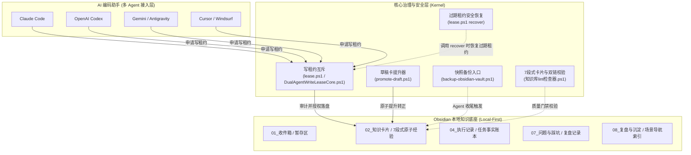

# Agent-Memory-OS 🧠⚡

<p align="center">
  <b>面向 AI 编程与多 Agent 协同的纯本地、并发安全的「外挂长期记忆」模板系统（Starter）</b><br>
  <i>缓解 Claude Code、OpenAI Codex、Gemini、Cursor 与 Windsurf 的会话失忆，避免多 Agent 写入互相覆盖。</i>
</p>

<p align="center">
  <a href="README.md">English</a> | <b>简体中文</b>
</p>

<p align="center">
  
  
  
  
  
  
  <a href="https://github.com/a2578348864a-sys/Agent-Memory-OS/actions/workflows/windows-ci.yml"></a>
  <a href="https://github.com/a2578348864a-sys/Agent-Memory-OS/releases/latest"></a>
</p>

<p align="center">
  
</p>

---

## 🌟 为什么需要 Agent-Memory-OS？

在 AI 编程（AI Coding）的日常开发中，每个开发者都会遭遇以下三大核心瓶颈：

1. **多模型失忆与割裂**：每次新建会话或重启窗口，AI 记忆彻底归零。同一个 Bug 在不同工具里反复踩坑，白白浪费海量 Token。
2. **多 Agent 并发写入踩踏**：尝试让多个 AI 并行跑任务时，经常发生文件覆盖、写入冲突、代码被撤销覆盖的灾难。
3. **市面方案太重、门槛太高**：动辄需要部署 Docker 容器、配置向量数据库、Redis 缓存或对接昂贵的云端 API，难以直接审查与维护。

**Agent-Memory-OS 是一套纯本地、Windows 优先的模板系统（Starter），提供以下能力：**

- 📂 **纯本地优先（Local-First）**：基于标准 Obsidian Markdown，所有卡片和经验都留在你自己的硬盘上，零外部服务依赖。
- 🔒 **本地多 Agent 写租约（Write Lease）**：内置轻量互斥写租约 CLI（`lease.ps1`），避免多模型并发写入互相覆盖；调用 `lease.ps1 recover` 时会检查并安全恢复已过期租约。
- 🛡️ **Agent 驱动的快照备份（Snapshot Workflow）**：一条命令（`backup-obsidian-vault.ps1`）即可生成带 SHA256 完整性清单的滚动 ZIP 快照；Agent 在写任务收尾时主动触发，保护知识卡片。
- 🎯 **场景化导航（Domain-Targeted Navigation）**：开工前先读 `08_复盘与沉淀/自动复用索引.md`，按场景靶向检索相关卡片，减少上下文稀释。
- 📐 **确定性质量门禁（Quality Gates）**：原子化 7 段式卡片合同 + 确定性 Lint 校验 + 原子转正工具（`promote-draft.ps1`），未审核草稿无法悄悄进入长期记忆。

> [!IMPORTANT]
> **能力边界**：写租约约束的是遵守本仓库协议的知识库写入，不会锁定或拦截 Agent/程序直接修改你的业务项目源码。

> [!NOTE]
> **环境要求**：Windows 10/11 系统，PowerShell 5.1 及以上版本（采用 Windows-first 原生设计）。

---

## 🏗️ 核心工作流与系统架构

<p align="center">
  
</p>



---

## ⚡ 痛点对比 (Comparison)

| 特性维度 | 传统单会话 AI / 提示词库 | 重型向量检索库 (RAG/Vector DB) | 静态提示词列表 (.cursorrules) | **Agent-Memory-OS (本项目)** |
| :--- | :--- | :--- | :--- | :--- |
| **持久性** | ❌ 换个窗口立即遗忘 | ⚠️ 依赖本地/云端服务常驻 | ⚠️ 静态，无法自我演进 | ✅ **永久纯本地存储（Markdown）** |
| **多 Agent 协同** | ❌ 毫无防护，并发踩踏 | ❌ 仅检索，无写锁机制 | ❌ 无并发保护 | 🏆 **本地写租约 + 过期租约安全恢复** |
| **部署成本** | ✅ 零配置 | ❌ 需 Docker / Redis / 数据库 | ✅ 复制粘贴 | 🏆 **克隆即用，零外部依赖** |
| **知识纯度** | ❌ 幻觉提示词满天飞 | ⚠️ 向量近似猜测，质量失控 | ❌ 未校验的文本块 | 🏆 **严格 7 段式卡片 + Lint 门禁** |
| **容灾保护** | ❌ 误删直接全损 | ⚠️ 需手动配置数据库备份 | ❌ 无备份机制 | 🏆 **滚动 ZIP 快照 + SHA256 清单** |
| **Token 消耗** | ❌ 全量提示词硬塞上下文 | ⚠️ 相似度检索产生海量噪点 | ❌ 高上下文稀释 | 🏆 **按场景靶向路由** |

---

## 🚀 3 分钟快速上手

### 第 1 步：使用模板并完成一键初始化
点击本页面右上角绿色的 **[Use this template]** -> **[Create a new repository]**。  
克隆你的新仓库到本地，在根目录打开 PowerShell 并执行一键设置：

```powershell
powershell -NoProfile -ExecutionPolicy Bypass -File "setup.ps1"
```

该脚本将自动生成本仓库独立的唯一 `vaultId`，创建隔离的互斥锁环境，并完成首轮健康体验。

### 第 2 步：接入你的 AI 编程助手
将本仓库挂载到你的工作空间中：
- **Claude Code**：在项目指令中引用 `CLAUDE.md`。
- **OpenAI Codex**：在项目指令中引用 `CODEX.md`。
- **Gemini / Antigravity**：在系统指令中引用 `GEMINI.md`。
- **Cursor / Windsurf**：在全局提示词中配置：
  > *“在编写代码或修改架构前，务必先阅读 `AGENTS.md` 并查阅 `08_复盘与沉淀/自动复用索引.md` 中的相关经验。”*

### 第 3 步：并发安全的日常操作
所有 AI 助手均通过标准的命令行接口进行操作。草稿模板只是起点、不是成稿——必须先填写真实内容并人工审核，才能进入 Promote（见第 0 步）：
```powershell
# 0. 先把草稿卡放入暂存区（演示：将草稿模板复制到 _drafts/）
Copy-Item "09_模板\知识卡片草稿模板.md" "02_知识卡片\_drafts\demo-card.md"

# 重要：模板只是起点，不是成稿。Promote 前必须编辑 demo-card.md：
#   - 替换占位标题（# 卡片标题（草稿））
#   - 填写 7 个章节（## 结论 … ## 来源）的真实内容
#   - 将 frontmatter 的 source: 指向 raw/ 下真实存在的资料（如 raw/demo-source.md）
#   - 在 ## 来源 章节中写明对应的真实来源
# 完成人工审核后，再申请租约并 Promote。

# 1. 修改文件前申请写租约，并从返回 JSON 中读取 leaseId
$lease = powershell -NoProfile -ExecutionPolicy Bypass -File "lease.ps1" acquire <your-agent> | ConvertFrom-Json
$leaseId = $lease.leaseId

# 2. 将审核合格的草稿原子提升为正式卡：必须显式传 Agent 身份与当前有效 leaseId
powershell -NoProfile -ExecutionPolicy Bypass -File "promote-draft.ps1" -DraftName demo-card -Agent <your-agent> -LeaseId $leaseId

# 3. 任务结束释放写租约
powershell -NoProfile -ExecutionPolicy Bypass -File "lease.ps1" release <your-agent> -LeaseId $leaseId

# 4. 触发全库滚动快照归档
powershell -NoProfile -ExecutionPolicy Bypass -File "backup-obsidian-vault.ps1"
```

---

## 📂 仓库目录结构说明

```text
Agent-Memory-OS/
├── README.md                     # 英文版项目文档
├── README_CN.md                  # [本文件] 简体中文项目文档
├── setup.ps1                     # 1-click 一键初始化与体检脚本
├── lease.ps1                     # 本地多 Agent 写租约 CLI 工具
├── promote-draft.ps1             # 原子两阶段草稿卡转正提升工具
├── backup-obsidian-vault.ps1     # 滚动快照备份入口（Agent 收尾触发）
├── reset-obsidian-lease.ps1      # 过期租约安全恢复入口（用户/Agent 调用时生效）
├── AGENTS.md                     # 多 Agent 协同统一规则源
├── CLAUDE.md / CODEX.md / GEMINI.md  # 各工具专属接入配置
├── 一键备份知识库.cmd             # Windows 极简双击备份入口
├── 一键重置写租约.cmd             # Windows 极简双击恢复入口
├── 01_收件箱/                    # 待整理的临时想法、原始材料暂存
├── 02_知识卡片/                  # 经审核的原子化工程知识（7 段式结构）
│   └── _drafts/                  # 新卡片草稿区（待审核提升）
├── 03_项目索引/                  # 跨项目关系索引目录
├── 04_执行记录/                  # 任务执行历史事实账本
├── 05_代码与配置/                # 治理内核：写租约、备份、过期租约恢复、Lint、提升器
├── 06_测试与验证/                # 206 项确定性断言套件（Lease/Lint/Reset/Backup/E2E: 36/77/10/15/68）与 Schema 契约
├── 07_问题与踩坑/                # 排查案例复盘，为卡片提炼提供事实来源
├── 08_复盘与沉淀/                # 场景化导航索引与可复用 Agent 规则
├── 09_模板/                      # 标准化卡片与决策模板
└── raw/                          # 外部原始资料（草稿 source 指向此处）
```

---

## 🛡️ 内置自动化测试与质量保障

Agent-Memory-OS 将长期记忆治理当作可测试的软件工程，配备 5 大自动化测试套件与 206 项确定性断言：

```powershell
# 1. 验证所有知识卡片的语法、7段式结构和双向链接
powershell -NoProfile -ExecutionPolicy Bypass -File "05_代码与配置/知识库lint检查器.ps1"

# 2. 运行 36 项断言的写租约互斥测试套件
powershell -NoProfile -ExecutionPolicy Bypass -File "06_测试与验证/DualAgentWriteLeaseCore.Tests.ps1"

# 3. 运行 77 项断言的卡片 Lint 校验器测试套件（正式卡、草稿、双链、合同）
powershell -NoProfile -ExecutionPolicy Bypass -File "06_测试与验证/知识库lint检查器.Tests.ps1"

# 4. 运行 10 项断言的 Reset 包装退出码语义套件（安全自愈与状态恢复）
powershell -NoProfile -ExecutionPolicy Bypass -File "06_测试与验证/ResetWrapper.Tests.ps1"

# 5. 运行 15 项断言的 Backup 包装测试套件（快照归档与 SHA256 清单）
powershell -NoProfile -ExecutionPolicy Bypass -File "06_测试与验证/BackupWrapper.Tests.ps1"

# 6. 运行 68 项断言的 Fresh-Clone 端到端旅程套件（多库隔离与提升原子回滚）
powershell -NoProfile -ExecutionPolicy Bypass -File "06_测试与验证/FreshCloneE2E.Tests.ps1"
```

---

## 🤝 贡献与开源许可

本项目基于宽松的 [MIT License](LICENSE) 开源。  
欢迎提交 Issue 和 Pull Request，共同打造面向未来的 AI 编程长期记忆底座！